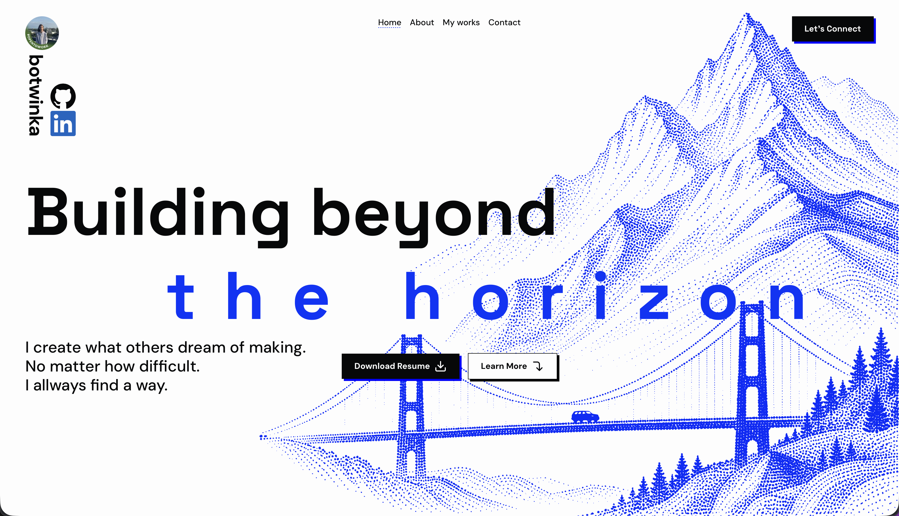

# My portfolio

A personal portfolio website showcasing my projects, resume, skills, and background, built with Next.js.


# View it live here: [click!](https://botwinkaportfolio.vercel.app)


Features:
- Seeing my projects
- Downloading my resume
- Reading about me
- Good SEO (hopefully??)

### If you see I made a mistake and want to shoot me a PR to improve the site:


- Download repo
- Install deps (bun (1.3.14) OR node (v24.18.0) bun is recommended because its fast but if you dont want to use it its fine the site does not depend on bun specific features): 
```bash
bun i
```
- Start dev server:
```bash
bun dev
```

Tech used:
- Next.JS
- Vercel
- Biome
- TailwindCSS
